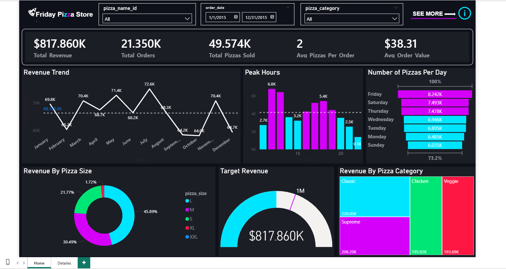

# SQL-PowerBI-Pizza-Sales-Analysis
End-to-end data analysis project using SQL Server for ETL and Power BI for visualization.
# 🍕 Pizza Sales Data Analysis (End-to-End)

## 📌 Project Overview
This project demonstrates an end-to-end data analysis workflow, starting from **SQL Server** for data import and processing, and concluding with **Power BI** for visualization and dashboard creation. The goal was to analyze sales trends, identify best-selling categories, and optimize operations during peak hours.

## 🛠️ Tools & Technologies Used
* **Database:** Microsoft SQL Server (SSMS)
* **Visualization:** Microsoft Power BI
* **Data Processing:** SQL (DDL, DML, DQL) & Power Query
* **Spreadsheet:** Excel (for initial flat file review)

## 🔄 Project Workflow
### 1. Data Setup & Database Creation (SQL Server)
* Created a dedicated database `Pizza_DB` in SQL Server.
* Imported the flat file (`pizza_sales.csv`) into the server.
* Validated data types and primary keys to ensure data integrity.

### 2. Data Cleaning & Analysis (SQL)
Before moving to Power BI, I used SQL to extract key metrics to validate my data:
* Calculated **Total Revenue**, **Average Order Value**, and **Total Pizzas Sold**.
* Grouped sales by **Category** and **Size**.
* Identified Top 5 and Bottom 5 performing pizzas.
SQL code.png

### 3. Data Visualization (Power BI)
* Connected Power BI directly to the SQL Server database.
* Created calculated measures using **DAX** (e.g., `DISTINCTCOUNT` for Orders, `DIVIDE` for AOV).
* Designed a custom dashboard with a "Dark Neon" aesthetic for high contrast.
* Implemented "Peak Hours" heatmaps to assist with workforce planning.

## 📊 Dashboard Preview
 

## 💡 Key Insights
1.  **Peak Activity:** The store is busiest on Fridays and Saturdays between 12:00 PM - 1:00 PM and 5:00 PM - 8:00 PM.
2.  **Best Sellers:** The "Classic" category contributes to the highest volume of sales.
3.  **Customer Behavior:** Large (L) size pizzas account for the highest revenue share, suggesting a family-oriented customer base.

---
*Created by Mohamed Samir*
